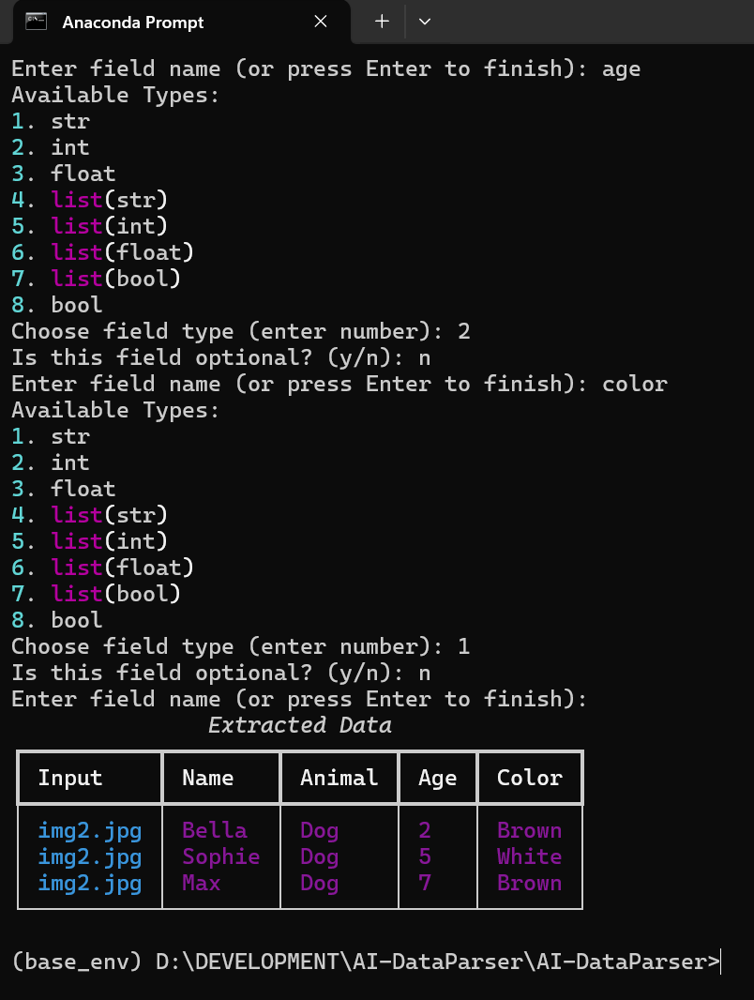

# AI Data Parser Documentation

## Overview

Dynamic Data Extractor is a versatile Command Line Interface (CLI) tool designed to extract structured data from various sources such as text, images, and bulk files. Leveraging Ollama's language models, this tool provides flexibility and efficiency in data extraction tasks.

---
In this project, I am using `llama3.2:3b` and `llama3.2:11b vision` from ollama.

## Installation

### Step 1: Clone the Repository
To get started, clone the repository to your local machine:
```bash
git clone https://github.com/iammuhammadnoumankhan/AI-DataParser.git
cd AI-DataParser
```

### Step 2: Create a Virtual Environment
Set up a virtual environment to manage dependencies:
```bash
python3 -m venv venv
source venv/bin/activate  # On Windows, use `venv\Scripts\activate`
```

### Step 3: Install Dependencies
Install the required dependencies using pip:
```bash
pip install -r requirements.txt
```

### Step 4: Configure .env
Modify the `.env` file with your Ollama server settings to ensure proper connectivity.


## Usage

**I will Recommend to watch this video on my youtube:** [youtube](https://youtu.be/HqaddgHPY8Q)

### Basic Usage

#### Extracting Data from Text
To extract data from a text input:
```bash
python cli.py --text "Your input text"
```
**Sample Output:**


#### Extracting Data from an Image
To extract data from an image:
```bash
python cli.py --image path/to/image.jpg
```
**Sample Output:**


#### Extracting Data from Bulk Text Files
To extract data from multiple text files:
```bash
python cli.py --bulk-text path/to/data.csv
```
**Sample Output:**


#### Extracting Data from Bulk Images
To extract data from multiple images in a folder:
```bash
python cli.py --bulk-images path/to/image/folder
```
**Sample Output:**


### Advanced Options

- `--display`: Choose the display format (json/table/none)
- `--export`: Choose the export format (json/csv/none)

### Filters
For extracting structure data from unstructure data, you will need to define your own filters, for refererence you can watch the my video on [YouTube](https://youtu.be/HqaddgHPY8Q) regarding this project.

---
Filters like:


## Contributing
We welcome contributions from the community.

## License
This project is licensed under the MIT License. See the [LICENSE](LICENSE) file for more details.

---


<!-- # Dynamic Data Extractor

## Overview
Dynamic Data Extractor is a flexible CLI tool for extracting structured data from text, images, and bulk files using Ollama's language models.

## Installation

1. Clone the repository
```bash
git https://github.com/iammuhammadnoumankhan/AI-DataParser.git
cd AI-DataParser
```

2. Create a virtual environment
```bash
python3 -m venv venv
source venv/bin/activate  # On Windows, use `venv\Scripts\activate`
```

3. Install dependencies
```bash
pip install -r requirements.txt
```

4. Configure .env
- Modify `.env` file with your Ollama server settings

## Usage

### Basic Usage
```bash
python cli.py --text "Your input text" 
python cli.py --image path/to/image.jpg
python cli.py --bulk-text path/to/data.txt
python cli.py --bulk-images path/to/image/folder
```

### Advanced Options
- `--display`: Choose display format (json/table/none)
- `--export`: Choose export format (json/csv/none)

## Contributing
Please read CONTRIBUTING.md for details on our code of conduct and the process for submitting pull requests.

## License
This project is licensed under the MIT License. -->
